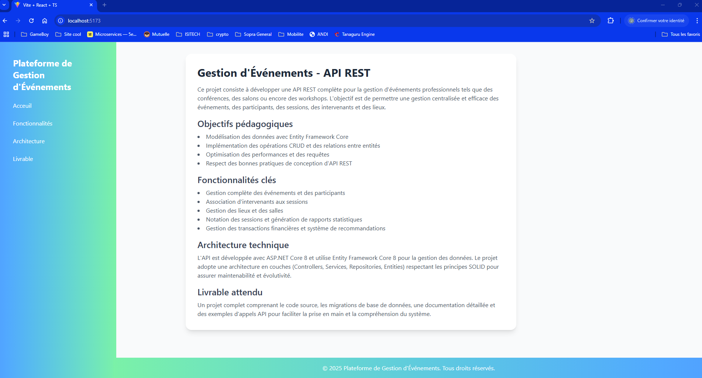

# Gestion d'Événements Professionnels

[URL REPO API](https://github.com/Flunshield/Entity-Framework/tree/main/Projets/TP%20-%20EXAMS/EventManagementAPI)

Ce projet est une plateforme de gestion d'événements professionnels. Elle permet de gérer les événements, les participants, les sessions, les intervenants et les lieux. L'objectif est de fournir une API REST performante et respectant les bonnes pratiques pour répondre aux besoins des utilisateurs.

## Table des matières
- Fonctionnalités
- Technologies Utilisées
- Installation
- Architecture
- Licence

## Fonctionnalités
- Gestion des événements : Création, mise à jour, suppression et affichage des événements.
- Gestion des lieux : Association des événements à des lieux spécifiques.
- Gestion des catégories : Organisation des événements par catégories.
- Interface utilisateur : Interface intuitive pour gérer les données.
- Documentation API : Documentation Swagger pour tester les endpoints REST.

## Technologies Utilisées
### Frontend
**Langage** : TypeScript, JavaScript  
**Framework** : React
**Bibliothèques** :
1. react-slick : Carrousel pour afficher les images.
2. tailwindcss : Framework CSS pour le style.

### Backend
**Framework** : ASP.NET Core 8.0.14  
**ORM** : Entity Framework Core 8.0.0  
**Base de données** : MariaDB

## Installation
### Prérequis
- Node.js (version 16 ou supérieure)  
- npm (ou yarn)  
- Serveur backend opérationnel (ASP.NET Core)

### Étapes
1. Clonez le dépôt :

```bash
git clone git@github.com:Flunshield/Entity-Framework.git
cd Projets/TP-EXAMS/EventManagementClient
```
2. Installez les dépendances :

```bash
npm install
```

3. Lancez l'application :

```bash
npm run preview
```

## Architecture
Le projet repose sur une architecture en couches respectant les principes SOLID pour garantir la maintenabilité et l’évolutivité du système.

### Détails Techniques
**Framework** : ASP.NET Core 8.0.14  
**ORM** : Entity Framework Core 8.0.0  
**SGBD** : MariaDB

### Principes
- Respect des standards RESTful
- Validation des données
- Gestion des exceptions
- Visualisation de la Bdd : http://localhost:8080/ (root/admin)
- Documentation via Swagger : http://localhost:5162/swagger/

## Visuel de l'app




## Licence
Ce projet est sous licence MIT. Vous pouvez l'utiliser, le modifier et le distribuer selon les termes de cette licence.

